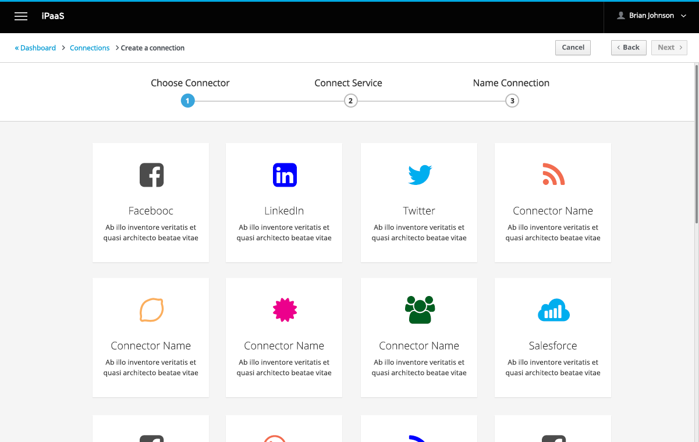
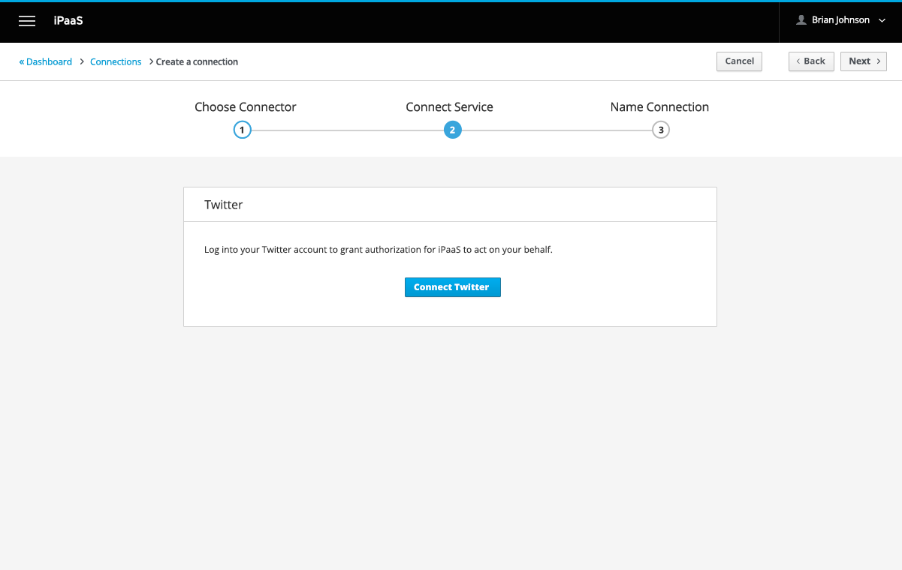
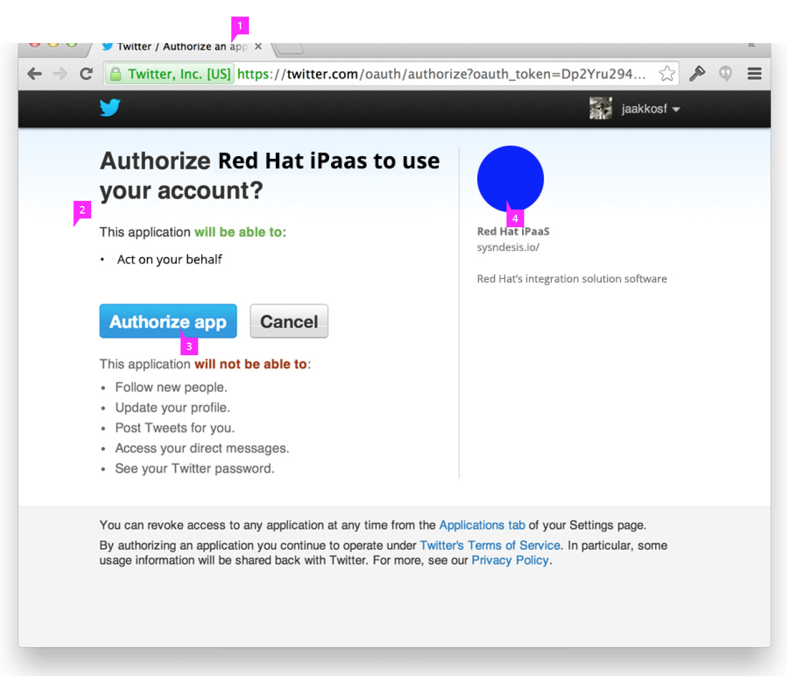
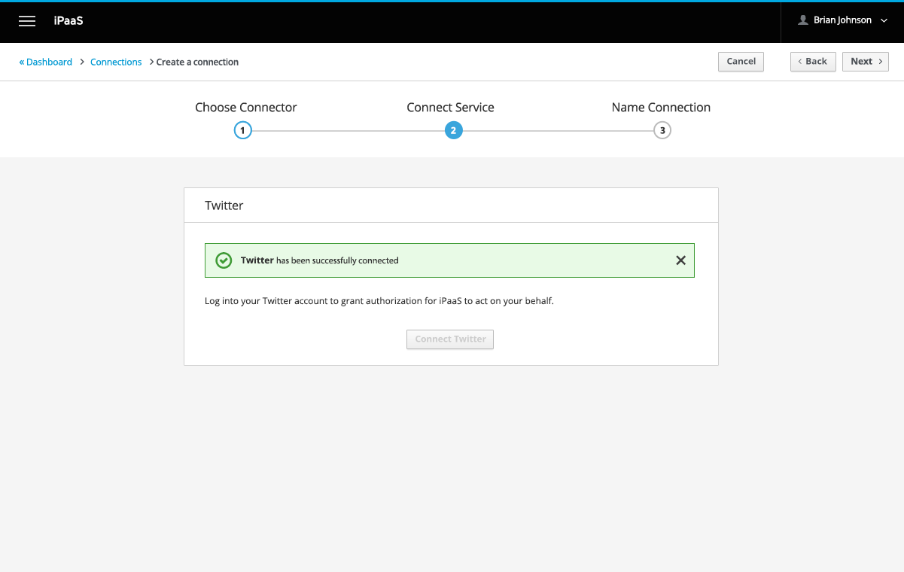
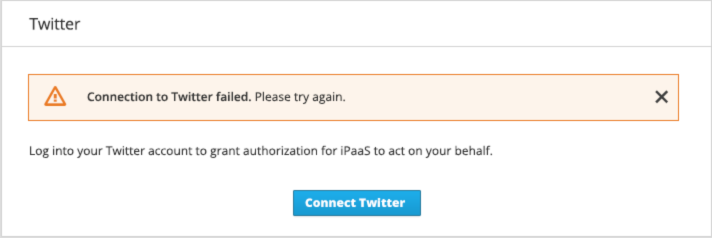
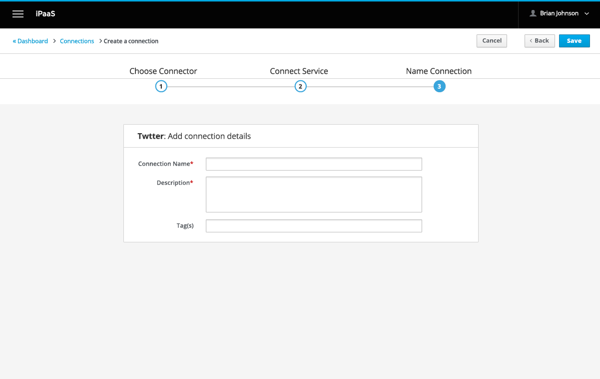
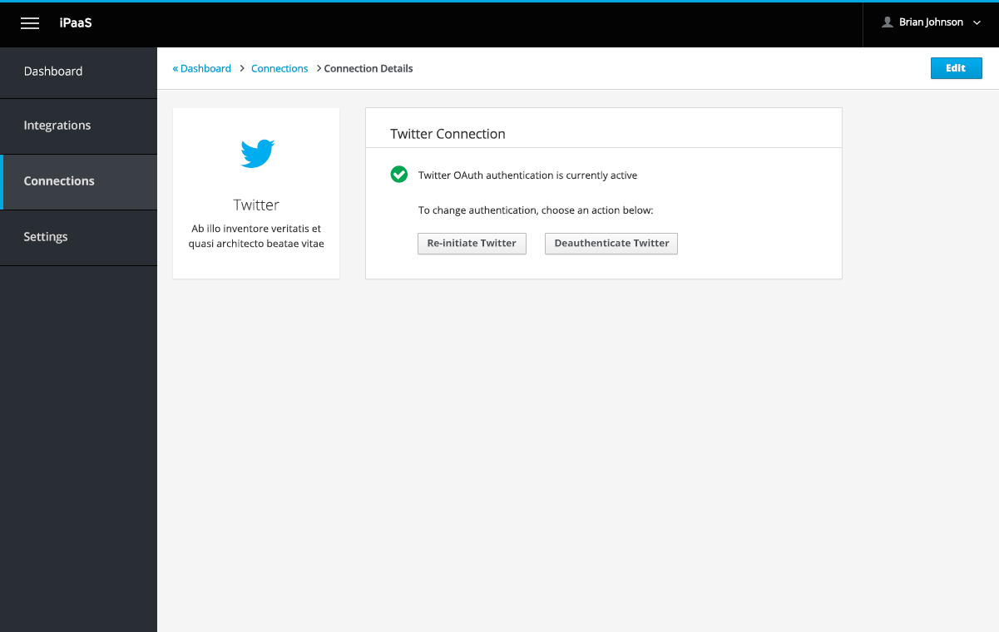

# OAuth Flow

Updates to the create a connection flow to account of OAuth feature for Twitter and Salesforce.

In this case, user chooses Twitter Connector.

User clicks on "Connect Twitter" button to start OAuth flow.

1. Clicking on button opens a new tab and takes user there.
1. OAuth will be different for each service but be sure to state what iPaaS will be doing.
1. Buttons to either Authorize app or Cancel. Both buttons will close tab and bring user back to iPaaS
1. iPaaS logo and app information when applicable

If user connects app then validation message should be displayed when user is taken back to ipaas tab.

If user cancelled or there was an error in authorization, user will see error message. Connect Twitter button will be enabled in this state.

After authorizing twitter, user can name their connection and give it a description.

- User can view connection details by clicking on specific connection in connections page.
- From here user can edit details by selecting the "Edit" button found in action bar.
- Details on authentication of connection also shown. User can also re-initiate or de-authenticate an existing connection.
